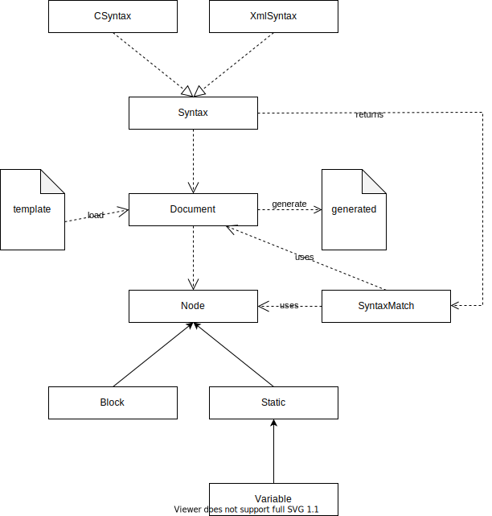
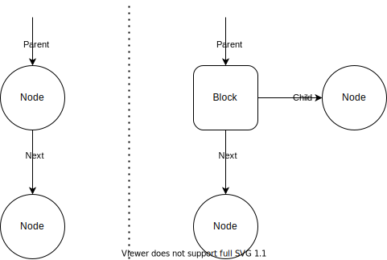

# Template Engine

This is a generic template engine for use in generating content in Java.  The API exposes a Document which allows you to load, populate, and generate templates.

One of the designs of this is to be able to operate on many different file formats including C based syntax, and XML based syntax.  This will allow the generation of XML, HTML, C, C++, C#, Java, JavaScript, etc.  The syntax engine can be extended to include others such as SQL.

# License
Copyright &copy; 2021 Lago Vista Technologies LLC

This program is free software: you can redistribute it and/or modify it under the terms of the GNU Affero General Public License as published by the Free Software Foundation, either version 3 of the License, or (at your option) any later version.

This program is distributed in the hope that it will be useful, but WITHOUT ANY WARRANTY; without even the implied warranty of MERCHANTABILITY or FITNESS FOR A PARTICULAR PURPOSE. See the GNU Affero General Public License for more details.

You should have received a copy of the GNU Affero General Public License along with this program. If not, see <https://www.gnu.org/licenses/>.

## Architecture

The following highlights the architecture of the template engine.



## Document Composition

Documents are made up of three types of nodes: blocks, static text, and variables.  The first node encountered is the root and start of the document.  This can be any type of node.  All node have a "next node", and operate in a linear fashion.  Each node can find its preceding/parent node as the parent is defined for it.



One note about the above diagram, a node can be any type - static, variable, or block.  **But note that only blocks have children.**

### Static Nodes

Static nodes contain text and content that cannot be changed.

### Variable Nodes

Variable nodes extend static node and the content can be set.

### Block Nodes

Blocks are a special node type where they can contains child nodes - blocks, static, and variables.

## Use

When using the template engine, you will start be creating a Document object and loading the template.  The "load" function will require either a file path or the template text, and the syntax of the document.

To populate the template, you'll set manipulate the variables and blocks.  The variables are straightforward, set them by name.  If the variable is not set, they will be omitted from the parsed document.  The variable can appear in the document multiple times.

Blocks allow the repetition of content many times over. Blocks may be nested inside blocks, and do not have to have unique names - you can have multiple blocks with the same name.  Since blocks may be nested, the system knows that a block is to be parsed once it's been touched.  If you do not touch a black, parsing does nothing.  When parsing a touched block, the generated static content will be inserted before the block.

For nested blocks that are children of parent blocks, when parsed, the generated static elements will not be duplicated in the parent block on subsequent parsing.  They will be migrated outside the block on each parse so the original block template will not change.

When done manipulating the template, call generate to be returned the generated content.

# Template Examples

The following are the examples of templates written for use with the template engine.

## XML Style Syntax

Blocks will be outlined as a comment, with "block IDENTIFIER" indicating the start of the block, and "/block IDENTIFIER" terminating the end of the block.  Variables will be defined with an identifier inside curly braces such as {IDENTIFIER}.

```html
<html>
	<head>
		<title>Page Title</title>
	</head>
	<body>
		<h1>Customer List</h1>
		<ul>
			<!-- block Customer -->
			<li>
				<b>{Customer Name}</b> {Phone} / {Cell}
				<!-- block Has Children -->
					<ul>
					<!-- block Contact -->
						<li><i>{Contact Name}</i> {Phone} / {Cell}</li>
					<!-- /block Contact -->
					<ul>
				<!-- /block Has Children -->
			<!-- /block Customer -->
		</ul>
</html>
```

## C Style Syntax

Blocks will be outlined as a line comment, with "BEGIN IDENTIFIER" indicating the start of the block, and "END IDENTIFIER" terminating the end of the block.  Variables will be defines as preceded by double underscores, and followed by double underscores _ _ IDENTIFIER _ _.  In the actual template, the double underscores will not have spaces between them.  Variables in C style syntax cannot contain spaces.

```java
package __PACKAGE__;

public class __TableCamelCase__ {
	// BEGIN Columns
		private __ColumnJavaType__ __ColumnLowerFirst__;
		public __ColumnJavaType__ get__ColumnCamelCase__() { return __ColumnLowerFirst__; }
		public void set__ColumnCamelCase__(__ColumnJavaType__ value) { __ColumnLowerFirst__ = value; }
	// END Columns
		
	public static void Copy(__TableCamelCase__ source, __TableCamelCase__ dest) {
		// BEGIN Columns
		dest.set__ColumnCamelCase__(source.get__ColumnCamelCase__());
		// END Columns
	}
}
```

# JavaDoc APIs

For casual users, the Document API would be the best starting point.  For developers and contributors, you will probably want to get familiar with the full API set.

- Document API

# History

The following is a list of changes over the lifetime of this theme template.

- PHP's HTML_Template_IT - this is where the idea for this template engine came from.
  https://pear.php.net/manual/en/package.html.html-template-it.php
- incTemplate - the prior versions of this were created by Shawn Zernik, the founder of Internetwork Consulting LLC.  It was implemented in C#, Java, and TypeScript.
- Lago Vista Technologies Template Engine - after closing Internetwork Consulting LLC, Shawn Zernik reimplemented the template engine using modern development approaches, namely test driven development.